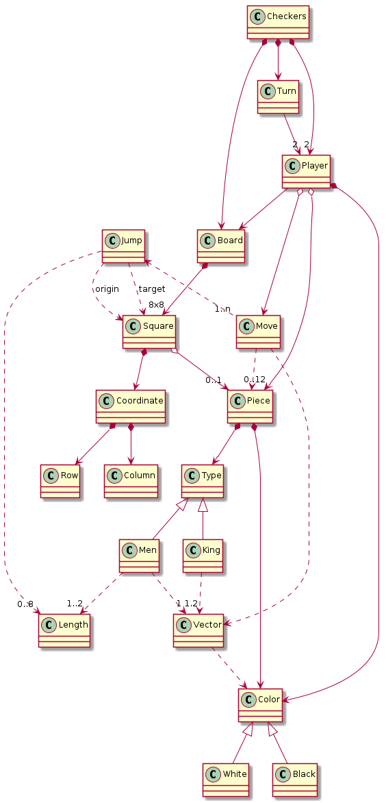
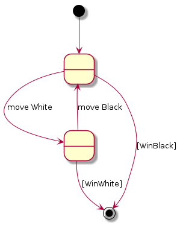

## Juego de "Las Damas"

Se propone realizar una implementación del juego de las damas, con consola.

El juego de las damas (denominación como se conoce el juego en España) es, si se puede decir, una simplificación del ajedrez, en la que solamente se juega con peones. Los peones se mueven en diagonal y pueden saltar por encima de otros peones para "comerlos".

Las instrucciones completas se pueden ver en la [wikipedia](https://es.wikipedia.org/wiki/Damas). Aunque ellos muestran como distintas implementaciones. Nosotros jugaremos en un tablero de 8x8 y donde cada jugador tiene 12 fichas de cada color. Este vídeo de Youtube [aclara las reglas en 2 minutos](https://www.youtube.com/watch?v=jA-zevc2fao).

1. [DomainModel](#domain-model)
2. [Instructions](#instructions)
3. [Requirements](docs/README.md)

## Domain Model

## Instructions

