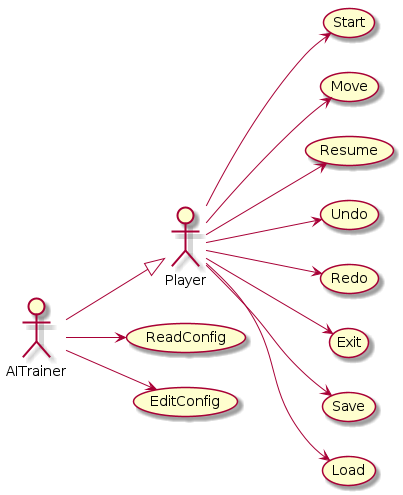
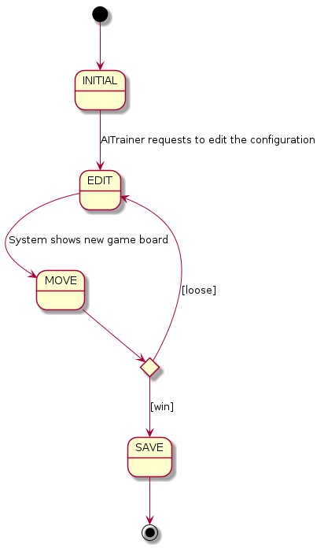
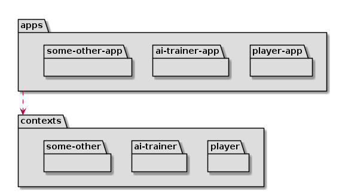
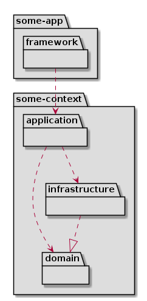

# Checkers requirements


- [Use cases](#use-cases)
  - [EditConfig use case](#editconfig-use-case)
- [Analysis](#analysis)
  - [Packages](#packages)
  - [Hexagonal Architecture](#hex-arch)
- [UI Prototype](#player-ui-prototype)
  - [Player](#player-ui-prototype)
  - [AI Trainer](#aitrainer-ui-prototype)

## Use cases



## EditConfig use case


## UI Prototype
### Player UI Prototype


```
1) NewGame
2) LoadGame
Option? [1-2]: 1
How many players?1

-------------------

Select difficulty? [1-8]: 1

-------------------
     columns
   0 1 2 3 4 5 6 7
0 ██● ██● ██● ██●
1 ● ██● ██● ██● ██
2 ██● ██● ██● ██●
3   ██  ██  ██  ██
4 ██  ██  ██  ██
5 ○ ██○ ██○ ██○ ██
6 ██○ ██○ ██○ ██○
7 ○ ██○ ██○ ██○ ██

1) Move
2) Exit
Option? [1-2]: 1
-------------------

select token from rowcolumn (ie: 21):21

-------------------

move to rowcolumn (ie: 30):30

-------------------

     columns
   0 1 2 3 4 5 6 7
0 ██● ██● ██● ██●
1 ● ██● ██● ██● ██
2 ██  ██● ██● ██●
3 ● ██  ██  ██  ██
4 ██  ██  ██○ ██
5 ○ ██○ ██  ██○ ██
6 ██○ ██○ ██○ ██○
7 ○ ██○ ██○ ██○ ██

1) Move
2) Undo
3) Exit
Option? [1-3]: 1

-------------------

...

-------------------

     columns
   0 1 2 3 4 5 6 7
0 ██◎ ██  ██  ██
1   ██  ██  ██  ██
2 ██  ██  ██  ██
3   ██○ ██○ ██  ██
4 ██  ██  ██◎ ██
5   ██○ ██  ██  ██
6 ██○ ██  ██  ██
7 ○ ██  ██  ██  ██
Player Black won!

Save game? (y/n): y
Insert game name: my-game
Restart? (y/n): y
```

### AITrainer UI Prototype

```
1) Read current config
2) Edit config
3) Load edit session
Option? [1-3]: 1

-----------------

Current values:
alpha: 0.45
beta: 7.2

1) Read current config
2) Edit config
3) Load edit session
Option? [1-3]: 2

-----------------
1) Edit [alpha]
2) Edit [beta]
Option? [1-2]: 1

-----------------

Insert new value for [alpha (0.45)]: 0.55

-----------------

1) Edit [alpha]
2) Edit [beta]
3) Test
Option? [1-3]: 3

-----------------

Win the game to save the new configuration!

     columns
   0 1 2 3 4 5 6 7
0 ██● ██● ██● ██●
1 ● ██● ██● ██● ██
2 ██● ██● ██● ██●
3   ██  ██  ██  ██
4 ██  ██  ██  ██
5 ○ ██○ ██○ ██○ ██
6 ██○ ██○ ██○ ██○
7 ○ ██○ ██○ ██○ ██

1) Move
2) Exit
Option? [1-2]: 1
-------------------

select token from rowcolumn (ie: 21):21

-------------------

move to rowcolumn (ie: 30):30

-------------------

...

-------------------

     columns
   0 1 2 3 4 5 6 7
0 ██◎ ██  ██  ██
1   ██  ██  ██  ██
2 ██  ██  ██  ██
3   ██○ ██○ ██  ██
4 ██  ██  ██◎ ██
5   ██○ ██  ██  ██
6 ██○ ██  ██  ██
7 ○ ██  ██  ██  ██
Player Black won!

-------------------

Save Configuration? (y/n): y

-------------------

Assign difficulty to this configuration(1-10): 6
Done!

```

## Analysis
### Packages


### Hexagonal Architecture


