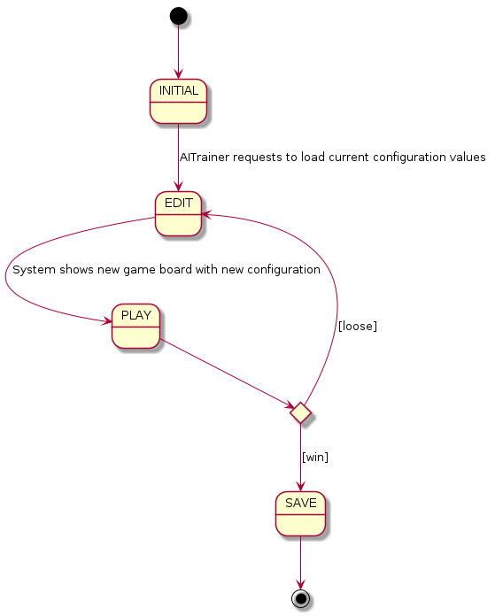

# Checkers requirements


- [Use cases](#use-cases)
  - [Edit use case view](#edit)
- [UI Prototype](#ui-prototype)


## Use cases


## Edit use case view


## UI Prototype

```
1) NewGame
2) LoadGame
Option? [1-2]: 1
How many players?1

-------------------
     columns
   0 1 2 3 4 5 6 7
0 ██● ██● ██● ██●
1 ● ██● ██● ██● ██
2 ██● ██● ██● ██●
3   ██  ██  ██  ██
4 ██  ██  ██  ██
5 ○ ██○ ██○ ██○ ██
6 ██○ ██○ ██○ ██○
7 ○ ██○ ██○ ██○ ██

1) Move
2) Exit
Option? [1-2]: 1
-------------------

select token from rowcolumn (ie: 21):21

-------------------

move to rowcolumn (ie: 30):30

-------------------

     columns
   0 1 2 3 4 5 6 7
0 ██● ██● ██● ██●
1 ● ██● ██● ██● ██
2 ██  ██● ██● ██●
3 ● ██  ██  ██  ██
4 ██  ██  ██○ ██
5 ○ ██○ ██  ██○ ██
6 ██○ ██○ ██○ ██○
7 ○ ██○ ██○ ██○ ██

1) Move
2) Undo
3) Exit
Option? [1-3]: 1

-------------------

...

-------------------

     columns
   0 1 2 3 4 5 6 7
0 ██◎ ██  ██  ██
1   ██  ██  ██  ██
2 ██  ██  ██  ██
3   ██○ ██○ ██  ██
4 ██  ██  ██◎ ██
5   ██○ ██  ██  ██
6 ██○ ██  ██  ██
7 ○ ██  ██  ██  ██
Player Black won!

Save game? (y/n): y
Insert game name: my-game
Restart? (y/n): y